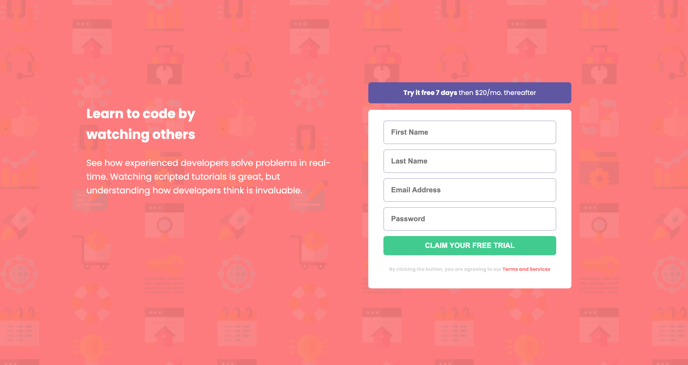

# Frontend Mentor -  Intro component with sign up form

## Welcome! 👋

Thanks for checking out this front-end coding challenge.

[Frontend Mentor](https://www.frontendmentor.io) challenges help you improve your coding skills by building realistic projects.

This is a solution to the [Intro component with sign up form challenge on Frontend Mentor](https://www.frontendmentor.io). Frontend Mentor challenges help you improve your coding skills by building realistic projects. 

## Table of contents

- [Overview](#overview)
  - [The project](#the-project)
  - [Screenshot](#screenshot)
  - [Links](#links)
- [My process](#my-process)
  - [Built with](#built-with)
  - [What I learned](#what-i-learned)
  - [Continued development](#continued-development)
  - [AI Collaboration](#ai-collaboration)
- [Author](#author)

## Overview

### The challenge

The challenge is to build out this introductory component and get it looking as close to the design as possible.

Users should be able to:

- View the optimal layout for the site depending on their device's screen size
- See hover states for all interactive elements on the page
- Receive an error message when the `form` is submitted if:
  - Any `input` field is empty. The message for this error should say _"[Field Name] cannot be empty"_
  - The email address is not formatted correctly (i.e. a correct email address should have this structure: `name@host.tld`). The message for this error should say _"Looks like this is not an email"_

### Screenshot

### Links

- Solution URL: [Add solution URL here](https://your-solution-url.com)
- Live Site URL: [Add live site URL here](https://your-live-site-url.com)

## My process

### Built with

- Semantic HTML5 markup
- CSS custom properties
- JavaScript

### What I learned

- I learnt the essence of using the width and max-width property to make apps more responsive
- I learnt how to break large problems into smaller chunks before tackling them
- I also improved my README file writing skills

### Continued development

I aim to improve my understanding of more advanced JavaScript concepts such as: asynchronous programming, testing, arrow functions and also solve tougher problems.

### AI Collaboration

 - I used chat GPT to better understand concepts, such as addEventListener function, which I applied in this project

## Author

- LinkedIn - [Kingsley Obiagwu](linkedin.com/in/kingsley-obiagwu)
- Frontend Mentor - [Kingsleigh](https://www.frontendmentor.io/profile/Kingsleigh-Obi)

